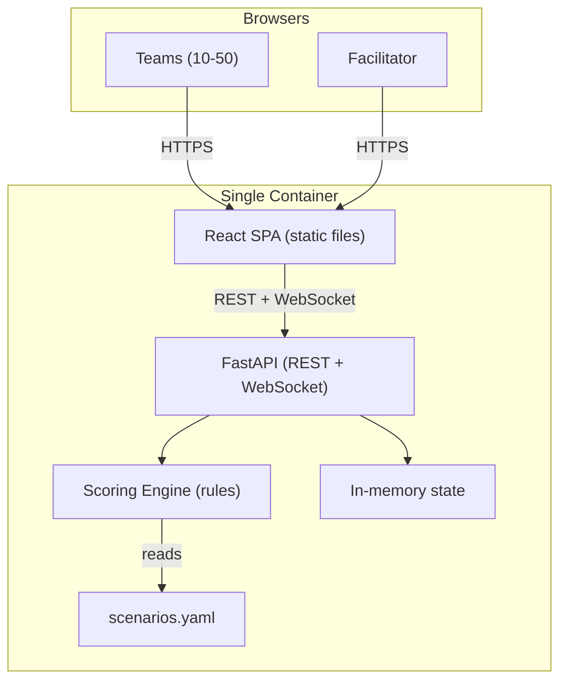
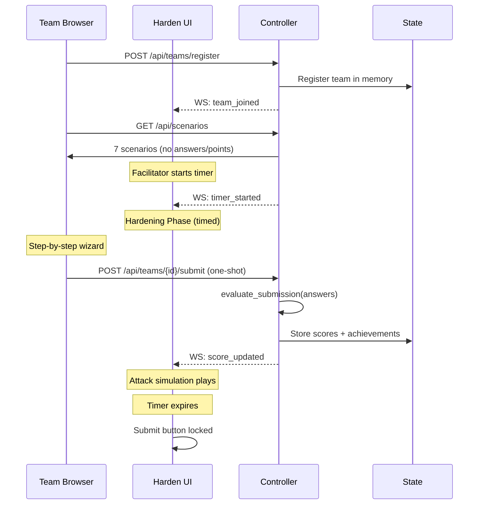

# Architecture: Harden the Box

**Related:** [PLAN.md](PLAN.md) | [CHANGELOG.md](CHANGELOG.md)

## Overview

Harden the Box is a gamified workshop exercise where teams answer scenario-based security questions about Kubernetes pod hardening and get scored instantly by a deterministic rules engine. A single container runs both the FastAPI backend and serves the React SPA as static files. No live Kubernetes cluster is required during the exercise.

## Component Topology

## Components

### Exercise Controller (`controller/`)

FastAPI application that orchestrates the exercise and serves the UI.

| Responsibility | Implementation |
|---|---|
| Team registration | Self-registration via Login page (`POST /api/teams/register`) |
| Scenario serving | Loads `scenarios.yaml`, strips answers, serves public scenarios via `GET /api/scenarios` |
| Submission scoring | Evaluates `ScenarioAnswer` selections against scenario definitions (one-shot) |
| Achievements | Computed from probe results (Network Guardian, RBAC Master, Lockdown, Perfect Score, First Blood) |
| Countdown timer | UTC end timestamp in state, broadcast via WebSocket |
| Real-time updates | WebSocket broadcast to all connected UI clients |
| Static file serving | React build served via FastAPI `StaticFiles` |

**State model:** In-memory Python dicts. Intentionally ephemeral — workshop duration is hours, not days.

### Scenario Definitions (`controller/app/scenarios.yaml`)

Externalized YAML file containing all 7 scenario questions. Each scenario has a category, situation text, multiple options with point values and probe mappings, and a `best` answer key. To customize the exercise, edit this file — no code changes needed.

Categories: Network (2), RBAC (2), SecurityContext (3).

### Harden UI (`ui/`)

React SPA built with Vite, served as static files by the controller in production. In development, Vite dev server proxies API calls.

| Page | Purpose |
|---|---|
| `/` (Login) | Team self-registration (enter team name, auto-registered) |
| `/harden` | Step-by-step scenario wizard with progress bar and review screen |
| `/scoreboard` | Live leaderboard with achievements, rank changes, probe details |
| `/admin` | Facilitator controls: countdown timer, team list, reset |

### Scoring Engine (`controller/app/services/scoring.py`)

Deterministic rules engine that evaluates scenario answer selections and produces probe results. Scoring is driven entirely by `scenarios.yaml` — each option defines its point value and which probes it blocks.

| Probe | Category | Blocked by (best option) |
|---|---|---|
| NET-01 | Network | Deny all egress (net-egress) |
| NET-02 | Network | Egress with scoped allow rules (net-egress) |
| NET-03 | Network | Ingress with scoped allow rules (net-ingress) |
| RBAC-01 | RBAC | Delete ClusterRoleBinding + scoped Role (rbac-crb) |
| RBAC-02 | RBAC | Scoped Role + resourceNames on Secrets (rbac-crb, rbac-secrets) |
| RBAC-03 | RBAC | Delete ClusterRoleBinding + scoped Role (rbac-crb) |
| SEC-01 | SecurityContext | readOnlyRootFilesystem + emptyDir (sec-filesystem, sec-capabilities) |
| SEC-02 | SecurityContext | runAsNonRoot + drop ALL caps (sec-root, sec-capabilities) |

## Exercise Flow

## Gamification

| Feature | Description |
|---|---|
| Attack simulation | Sequential probe reveal with Smith flavor text and animations |
| Achievements | Network Guardian, RBAC Master, Lockdown, Perfect Score, First Blood |
| Leaderboard | Rank change arrows, score animations, top-3 podium styling |
| Countdown timer | Facilitator-controlled, visible on all pages, locks submissions |
| One-shot submission | Teams submit once — no retries, raising the stakes |

## Deployment

Single Docker image built from `build/Dockerfile` (multi-stage):
1. Node 22 Alpine builds the React SPA
2. UBI9 Python 3.12 runs FastAPI + serves static files

Build: `make build` or `podman build -f build/Dockerfile -t harden-the-box:latest .`

Local development: `make install && make dev` (runs controller + Vite dev server in parallel).

## Key Design Decisions

- **Single container** over multi-container — workshop scope doesn't justify managing multiple images
- **Scenario-based quiz** over toggle form — trade-off questions are more engaging and educational than binary toggles
- **Externalized YAML** over Python data — facilitators can customize scenarios without code changes
- **Rules engine** over live probes — deterministic scoring without requiring a K8s cluster
- **In-memory state** over database — workshop lasts hours, simplicity wins
- **One-shot submission** over iterative — prevents trial-and-error, forces deliberate choices
- **Client-side attack simulation** over real attacks — identical scoring, dramatic presentation
