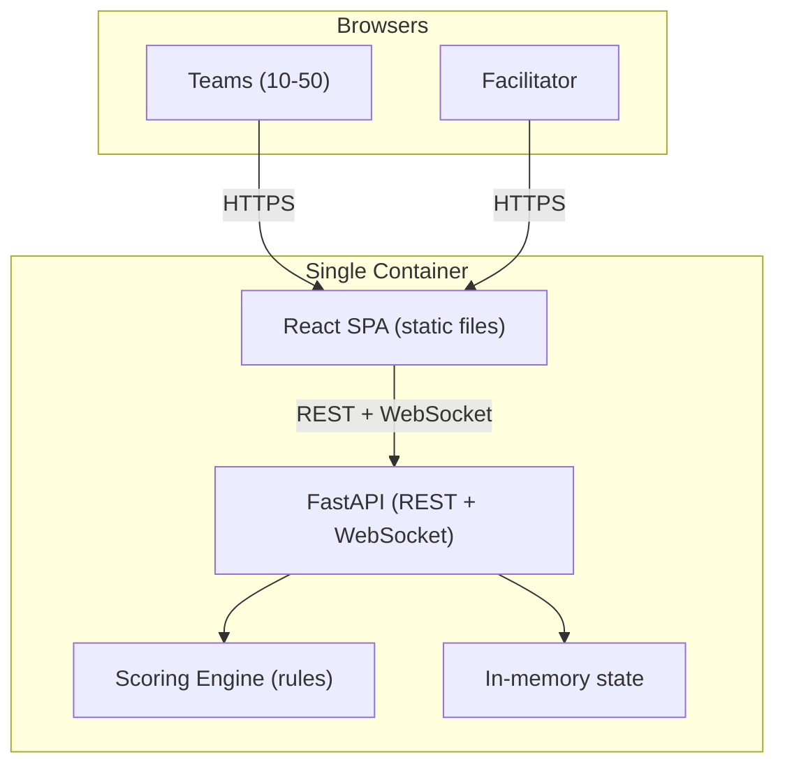
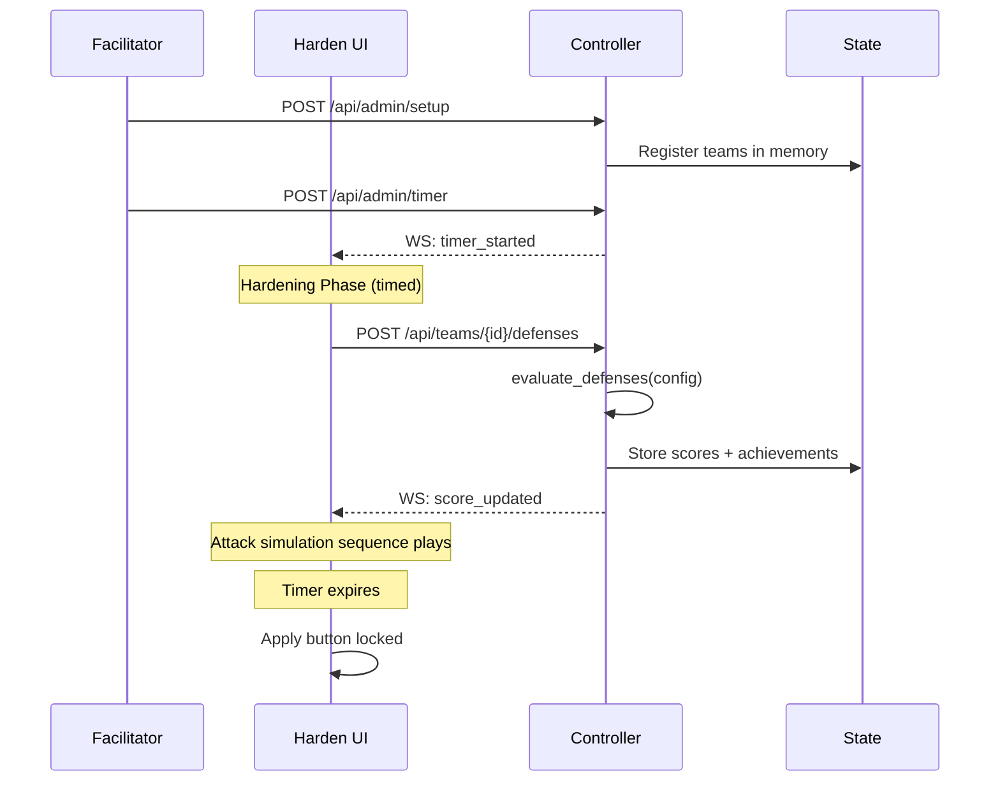

# Architecture: Harden the Box

**Related:** [PLAN.md](PLAN.md) | [CHANGELOG.md](CHANGELOG.md)

## Overview

Harden the Box is a gamified workshop exercise where teams configure Kubernetes pod defenses via a web UI and get scored instantly by a deterministic rules engine. A single container runs both the FastAPI backend and serves the React SPA as static files. No live Kubernetes cluster is required during the exercise.

## Component Topology

## Components

### Exercise Controller (`controller/`)

FastAPI application that orchestrates the exercise and serves the UI.

| Responsibility | Implementation |
|---|---|
| Team registration | In-memory dict, created via Admin API |
| Defense scoring | Rules engine evaluates `DefenseConfig` against 9 probe rules |
| Achievements | Computed from probe results (Network Guardian, RBAC Master, etc.) |
| Countdown timer | UTC end timestamp in state, broadcast via WebSocket |
| Real-time updates | WebSocket broadcast to all connected UI clients |
| Static file serving | React build served via FastAPI `StaticFiles` |

**State model:** In-memory Python dicts. Intentionally ephemeral — workshop duration is hours, not days.

### Harden UI (`ui/`)

React SPA built with Vite, served as static files by the controller in production. In development, Vite dev server proxies API calls.

| Page | Purpose |
|---|---|
| `/` (Login) | Team identification (code entry) |
| `/harden` | Defense configurator with toggles, strength meter, attack simulation |
| `/scoreboard` | Live leaderboard with achievements, rank changes, probe details |
| `/admin` | Facilitator controls: setup, countdown timer, reset |

### Scoring Engine (`controller/app/services/scoring.py`)

Deterministic rules that evaluate a `DefenseConfig` and produce probe results identical to what the old Smith Runner bash probes would have produced.

| Probe | Category | Points | BLOCKED when |
|---|---|---|---|
| NET-01 | Network | 10 | `deny_all_egress` enabled |
| NET-02 | Network | 10 | `deny_all_egress` enabled |
| NET-03 | Network | 15 | `deny_all_ingress` enabled |
| RBAC-01 | RBAC | 10 | `delete_cluster_role_binding` enabled |
| RBAC-02 | RBAC | 15 | Namespaced role without `secrets` in allowed resources |
| RBAC-03 | RBAC | 10 | Namespaced role without `delete` in allowed verbs |
| SEC-01 | SecurityContext | 10 | `read_only_root_filesystem` enabled |
| SEC-02 | SecurityContext | 10 | `run_as_non_root` enabled |
| ESC-01 | Kernel | 0 | Always PASSED (Kata Containers — future) |

## Exercise Flow

## Gamification

| Feature | Description |
|---|---|
| Attack simulation | Sequential probe reveal with Smith flavor text and animations |
| Defense strength meter | Real-time gauge showing coverage as toggles are flipped |
| Achievements | Network Guardian, RBAC Master, Lockdown, Perfect Score, First Blood |
| Leaderboard | Rank change arrows, score animations, top-3 podium styling |
| Countdown timer | Facilitator-controlled, visible on all pages, locks submissions |

## Deployment

Single Docker image built from `build/Dockerfile` (multi-stage):
1. Node 22 Alpine builds the React SPA
2. UBI9 Python 3.12 runs FastAPI + serves static files

Build: `make build` or `podman build -f build/Dockerfile -t harden-the-box:latest .`

The app can run locally (`make dev-controller` + `make dev-ui`) or as a single container anywhere.

## Key Design Decisions

- **Single container** over multi-container — workshop scope doesn't justify managing 3 images
- **Rules engine** over live probes — deterministic scoring without requiring a K8s cluster
- **In-memory state** over database — workshop lasts hours, simplicity wins
- **Client-side attack simulation** over real attacks — identical scoring, dramatic presentation
